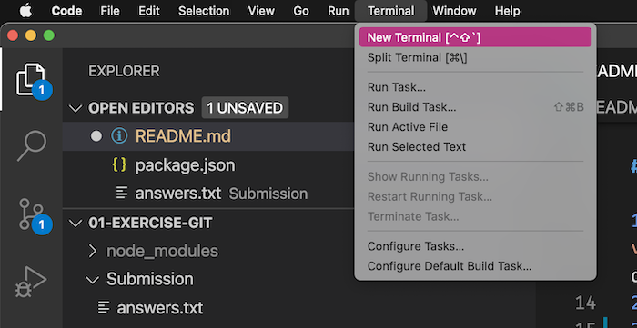
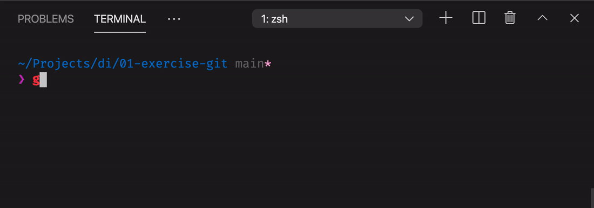

# 01 Exercise - Two Truths and a Lie

## Brief

Welcome to your first Developers Institute exercise. All the exercises and projects you complete will follow this same format.

For this exercise, you will be playing the two truths and a lie game with your cohort. To start, we need to capture the data from each person.

Complete the instructions below to submit your answers, and at the same time test your end to end workflow using Google Classrooms and GitHub.

## Rationale

You will be following the same process for this exercise every day on course, so it's important to make sure that it works!

## Instructions - Two Truths and a Lie

1. Clone this git repository to your computer. Watch the [git walkthrough tutorial video](https://vimeo.com/433825571/bc1830fb90) if you need help understanding how to do this
2. Open `Submission/answers.txt` in VS Code
3. Answer the three questions in `answers.txt` with two interesting things about you that are true, and one that is a lie. Save your changes to this file.
4. Open your Terminal in VS Code

   

5. Add your change to git, commit the change with a message, and push it to GitHub

   

---

# Submit your Exercise

- [ ] Commits are pushed to GitHub
- [ ] Assignment is marked as complete in Google Classroom

---

<details>
  <summary>
    Git CLI Refresher
  </summary>

If you need help remembering what commands to type with `git`, use the following as a reference, or watch the [git walkthrough tutorial video](https://vimeo.com/433825571/bc1830fb90)

```shell
# when ready to commit and push
git add .

git commit -m "Completed Part A"

git push origin main
```

</details>
