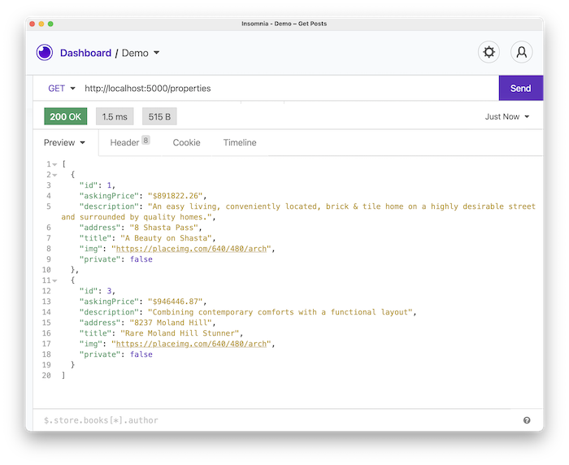

# 02 Exercise - Add unit tests to an Express Application

## Brief

You will build an endpoint for the House Tricks API to retrieve all the property listings. Your Tech Lead has provided you with a starting point, so you only need to add an endpoint to the Express Route.

You will need to filter out properties that have `private` set to `true`, ensure this functionality has an automated test, and that it runs when you type `npm test`. 

Your Tech Lead has installed Jest, made it run on `npm test`, and created a separate test for your Express App, which you will see running alongside your own test.

The endpoint you build will meet the following specifications:

### Request

- Endpoint: `/properties`
- Method: `GET`

### Response 

- Status code: `200`
- JSON body: See screenshot below

## Getting Started

1. Open your Terminal in VS Code, and install the required dependencies: `npm install`.
2. Start the API server: `npm start`.
3. Open `src/app.js` in VS Code, and find the code comment that starts with `// FIXME`. This is where you will be writing your code.

## Instructions

1. Create two new files in the `src` folder: `filterProperties.js` and `filterProperties.test.js`.
2. Update `filterProperties.js` so that it exports a function that meets the following specification:
   - Takes an argument that is an array of properties
   - Returns a new array that filters out properties with `private: true`.
3. Ensure there is an adequate automated test for this function
4. Ensure all tests pass when you type: `npm test`.

--- 

# Submit your Exercise

- [ ] Automated tests pass in GitHub
- [ ] Turned in exercise in iQualify

