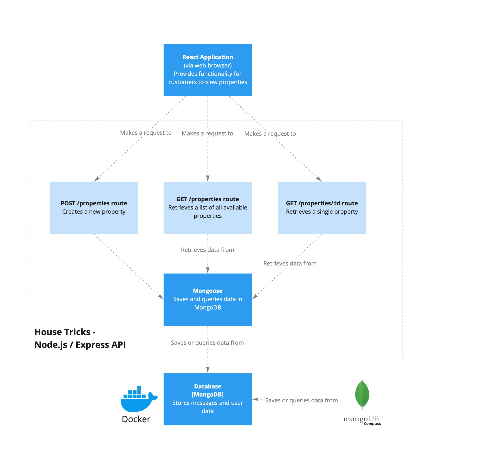

[](https://classroom.github.com/online_ide?assignment_repo_id=11187318&assignment_repo_type=AssignmentRepo)
# 02 Exercise - Create properties for House Tricks in Express/MongoDB

# Scenario

The real estate agent from House Tricks Real Estate company has come back with some new requirements. Currently, she emails you anytime she wants a new property displayed on the web application, and you manually load it into the database. She wants to be able to add properties by herself.

# Architecture diagram



# API specification

Your API should conform to the following specification.

---

## Show Properties

Get a list of all properties currently listed.

**URL** : `/properties`

**Method** : `GET`

### Success Response

**Code** : `200 OK`

**Content example**

```json
[
  {
    "id": "61480db44ab0cf7175467757",
    "description": "An easy living, conveniently located, brick & tile home on a highly desirable street and surrounded by quality homes.",
    "address": "8 Shasta Pass",
    "title": "A Beauty on Shasta",
    "img": "https://placeimg.com/640/480/arch",
    "askingPrice": "$891822.26"
  },
  {
    "id": "61480db44ab0cf7175467755",
    "description": "Large Executive townhouse bordering On Town Centre",
    "address": "2 Bowman Avenue",
    "title": "Bowman Brilliance – Style and Value!",
    "img": "https://placeimg.com/642/482/arch",
    "askingPrice": "$876330.57"
  },
  {
    "id": "61480db44ab0cf7175467756",
    "description": "Combining contemporary comforts with a functional layout",
    "address": "8237 Moland Hill",
    "title": "Rare Moland Hill Stunner",
    "img": "https://placeimg.com/644/484/arch",
    "askingPrice": "$946446.87"
  }
]
```

---

## Show Single Property

Get a single property.

**URL** : `/properties/:id`

**URL Parameters** : `id=[string]` where `id` is the ID of the property on the server.

**Method** : `GET`

### Success Response

**Code** : `200 OK`

**Content example**

Request: `GET /properties/61480db44ab0cf7175467757`

```json
{
  "id": "61480db44ab0cf7175467757",
  "description": "An easy living, conveniently located, brick & tile home on a highly desirable street and surrounded by quality homes.",
  "address": "8 Shasta Pass",
  "title": "A Beauty on Shasta",
  "img": "https://placeimg.com/640/480/arch",
  "askingPrice": "$891822.26"
}
```

### Error Responses

**Condition** : If `id` parameter is an invalid id.

**Code** : `400 BAD REQUEST`

**Content** : `{ message: "id provided is invalid"}`

---

**Condition** : If Property does not exist with `id` parameter.

**Code** : `404 NOT FOUND`

**Content** : `{ message: "id not found"}`

## Create new Property

Create a new property for sale that will be displayed.

**URL** : `/properties`

**Method** : `POST`

**Request body example**

```json
{
  "description": "An easy living, conveniently located, brick & tile home on a highly desirable street and surrounded by quality homes.",
  "address": "8 Shasta Pass",
  "title": "A Beauty on Shasta",
  "img": "https://placeimg.com/640/480/arch",
  "askingPrice": "$891822.26"
}
```

### Success Response

**Code** : `200 OK`

**Content example**

```json
{
  "id": "615994b40082f6819860b55f",
  "description": "An easy living, conveniently located, brick & tile home on a highly desirable street and surrounded by quality homes.",
  "address": "8 Shasta Pass",
  "title": "A Beauty on Shasta",
  "img": "https://placeimg.com/640/480/arch",
  "askingPrice": "$891822.26"
}
```

---

## Getting started

### Server

- Open a Terminal in VS Code for this project
- Type `npm install` to install npm dependencies
- Type `npm start` to start the Express Server

### MongoDB Database

- Start MongoDB in Docker by opening a terminal and `copy & paste` in the following: 
```shell
docker run --name 02-exercise-house-tricks-create-properties-mongo_db \
  -p 27017:27017 \
  -v 02-exercise-house-tricks-create-properties-mongo_db_data_container:/data/db \
  -d \
  mongo
``` 
- Connect to MongoDB using  [MongoDB Compass](https://www.mongodb.com/products/compass). Create a database named `mongo`, and load data from the [data](./data) folder into the database.
- Don't forget to [connect to MongoDB using Mongoose](https://mongoosejs.com/docs/connections.html) in `server.js`

---

# User Story #1

- As a first home buyer
- I want to view a list of properties for sale
- So that I can find a property I am interested in

## Acceptance criteria

- The Express route for `GET /properties` meets the API specification
- MongoDB and Mongoose are used to retrieve the data for the API response
- The code for the Express application is well tested with automated tests

---

# User Story #2

- As a first home buyer
- I want to view a single property
- So I can share a link to the property with my partner

## Acceptance criteria

- The Express route for `GET /properties/:id` meets the API specification
- MongoDB and Mongoose are used to retrieve the data for the API response
- The code for the Express application is well tested with automated tests

---

# User Story #3

- As the real estate agent for House Tricks
- I want to add a new property to the website
- So potential customers can view and purchase the property

## Acceptance criteria

- The Express route for `POST /properties` meets the API specification
- MongoDB and Mongoose are used to store and respond with data for the API response
- The code for the Express application is well tested with automated tests

---

# Submit your Exercise

- [ ] Commits are pushed to GitHub
- [ ] Automated tests pass in GitHub
- [ ] Exercise is submitted in Google Classroom
