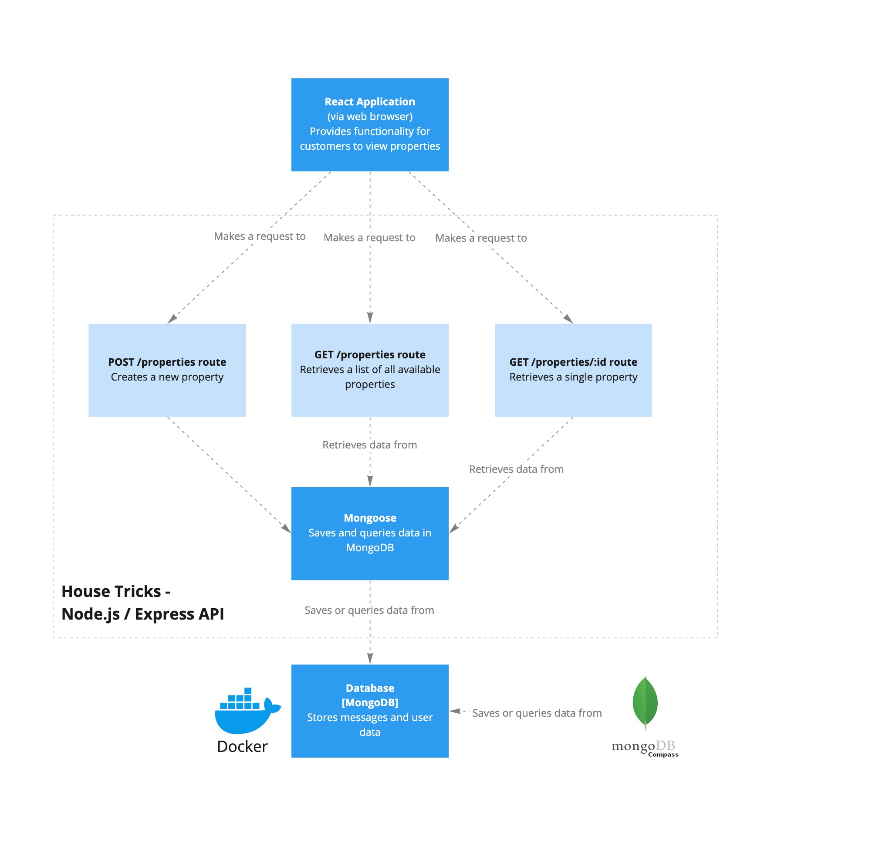

[](https://classroom.github.com/online_ide?assignment_repo_id=11192233&assignment_repo_type=AssignmentRepo)
# 02 Exercise - Create properties for House Tricks in React

# Scenario

The real estate agent from House Tricks Real Estate company has requested a new feature on her web application. Currently, she emails you anytime she wants a new property displayed on the web application, and you manually load it into the database. She wants to be able to add properties by herself.

# Architecture diagram



# API specification

The API is a Mongo/Express application in the [`./server`](./server) folder. The Express API meets the specification below.

---

## Show Properties

Get a list of all properties currently listed.

**URL** : `/properties`

**Method** : `GET`

### Success Response

**Code** : `200 OK`

**Content example**

```json
[
  {
    "id": "61480db44ab0cf7175467757",
    "description": "An easy living, conveniently located, brick & tile home on a highly desirable street and surrounded by quality homes.",
    "address": "8 Shasta Pass",
    "title": "A Beauty on Shasta",
    "img": "https://placeimg.com/640/480/arch",
    "askingPrice": "$891822.26"
  },
  {
    "id": "61480db44ab0cf7175467755",
    "description": "Large Executive townhouse bordering On Town Centre",
    "address": "2 Bowman Avenue",
    "title": "Bowman Brilliance – Style and Value!",
    "img": "https://placeimg.com/642/482/arch",
    "askingPrice": "$876330.57"
  },
  {
    "id": "61480db44ab0cf7175467756",
    "description": "Combining contemporary comforts with a functional layout",
    "address": "8237 Moland Hill",
    "title": "Rare Moland Hill Stunner",
    "img": "https://placeimg.com/644/484/arch",
    "askingPrice": "$946446.87"
  }
]
```

---

## Show Single Property

Get a single property.

**URL** : `/properties/:id`

**URL Parameters** : `id=[string]` where `id` is the ID of the property on the server.

**Method** : `GET`

### Success Response

**Code** : `200 OK`

**Content example**

Request: `GET /properties/61480db44ab0cf7175467757`

```json
{
  "id": "61480db44ab0cf7175467757",
  "description": "An easy living, conveniently located, brick & tile home on a highly desirable street and surrounded by quality homes.",
  "address": "8 Shasta Pass",
  "title": "A Beauty on Shasta",
  "img": "https://placeimg.com/640/480/arch",
  "askingPrice": "$891822.26"
}
```

### Error Responses

**Condition** : If `id` parameter is an invalid id.

**Code** : `400 BAD REQUEST`

**Content** : `{ message: "id provided is invalid"}`

---

**Condition** : If Property does not exist with `id` parameter.

**Code** : `404 NOT FOUND`

**Content** : `{ message: "id not found"}`

## Create new Property

**URL** : `/properties`

**Method** : `POST`

**Request body example**

```json
{
  "description": "An easy living, conveniently located, brick & tile home on a highly desirable street and surrounded by quality homes.",
  "address": "8 Shasta Pass",
  "title": "A Beauty on Shasta",
  "img": "https://placeimg.com/640/480/arch",
  "askingPrice": "$891822.26"
}
```

### Success Response

**Code** : `201 Created`

**Content example**

```json
{
  "id": "615994b40082f6819860b55f",
  "description": "An easy living, conveniently located, brick & tile home on a highly desirable street and surrounded by quality homes.",
  "address": "8 Shasta Pass",
  "title": "A Beauty on Shasta",
  "img": "https://placeimg.com/640/480/arch",
  "askingPrice": "$891822.26"
}
```

---

## Getting started

### Reference material

Use these tutorials to help you complete this exercise.

- [Full React Tutorial #27 - Controlled Inputs (forms)](https://www.youtube.com/watch?v=IkMND33x0qQ) (10mins)
- [Full React Tutorial #28 - Submit Events](https://youtu.be/pJiRj02PkJQ) (3mins)
- [Full React Tutorial #29 - Making a POST Request](https://youtu.be/EcRFYF4B3IQ) (5mins)
- [Full React Tutorial #30 - Programmatic Redirects](https://youtu.be/TmVqwhBUiSM) (4mins)
  - [React Router 6 Tutorial #3 - Redirects & useNavigate](https://youtu.be/zCgruoRUxlk?t=356) (2min from 5mins 56s) Follow to update from `useHistory` to `useNavigate`

### Server

- Open a Terminal in VS Code for this project
- Type `cd server` to move into the server directory
- Type `npm install` to install npm dependencies
- Type `npm start` to start the Express Server

### React application (client)

- In a new Terminal, type `cd client` to move into the client directory
- Type `npm install` to install npm dependencies
- Type `npm start` to start the React development server

### MongoDB Database

- Start MongoDB in Docker by opening a terminal and `copy & paste` in the following: 
```shell
docker run --name 02-exercise-house-tricks-create-properties-in-react-mongo_db \
  -p 27017:27017 \
  -v 02-exercise-house-tricks-create-properties-in-react-mongo_db_data_container:/data/db \
  -d \
  mongo
```

---

# User Story

- As the real estate agent for House Tricks
- I want to add a new property to the website
- So potential customers can view and purchase the property

## Acceptance criteria

- When navigating to the [Add property](http://localhost:3000/add) route in the React Application, then a form is displayed that has inputs for all the property details
  - **Label:** Title, **Input:** text, **Required:** true
  - **Label:** Asking Price, **Input:** text, **Required:** true
  - **Label:** Description, **Input:** text, **Required:** true
  - **Label:** Address, **Input:** text, **Required:** true
  - **Label:** Image URL, **Input:** text, **Required:** true
- The labels have [`htmlFor`](https://reactjs.org/docs/dom-elements.html#htmlfor) attributes, that link to the input id. 
  - Watch the [htmlFor attribute in React tutorial](https://www.loom.com/share/2bdb9bd6ce194299ae95c42cc59e523a) that explains the `htmlFor` attribute
- The form submit button text is `Submit`.
- When the submit button is clicked, then an API request is made to create a new property, using the values from the form inputs
- When the API response is successful, then the customer is redirected back to the homepage route (`"/"`) 

---

# Submit your Exercise

- [ ] Commits are pushed to GitHub
- [ ] Automated tests pass in GitHub
- [ ] Exercise is submitted in iQualify
