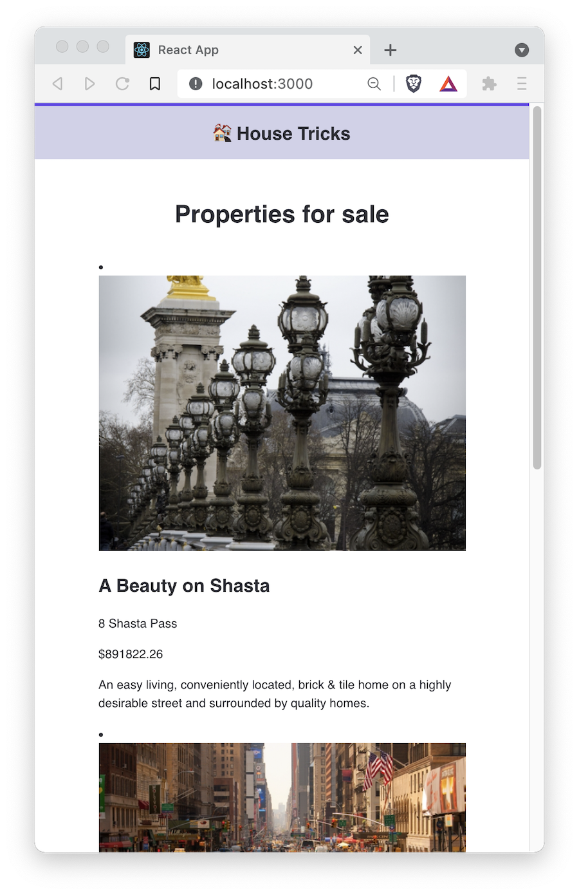

# 02 Exercise - API Requests in React

## Brief

You will update an existing React Application to display all the properties from the House Tricks API.

## Getting Started

This repository is separated into two parts: client and server. `client` contains the React application, and `server` contains the Express server.

Watch the [Getting started video](https://www.loom.com/share/b13b4853b5a24839844e52e0925af047) that demonstrates the below steps.

### Part 1: Client

1. Open your Terminal in VS Code, and move into the client directory: `cd client`
2. Install the required dependencies: `npm install`
3. Start the React server: `npm start`
4. Open `src/App.js` in VS Code.

### Part 2: Server

1. Open a new Terminal window in VS Code, move into the server directory, type: `cd server`
2. Install the required dependencies: `npm install`
3. Start the API server: `npm start` This will start an Express server at `http://localhost:5001`
4. Open Insomnia, and test the server is working by making a `GET` request to the following URL: `http://localhost:5001/properties`. You should get a response for all properties. Seeing a status code of `200` and JSON in the response body means your API server is working as expected.

## Instructions Part A - Configure React State

Follow along with [Configure React State](https://www.loom.com/share/cb3afc4a99c74a2b8746945fbf06f950)

## Instructions Part B - Fetch the properties

Follow along with [Fetch House Tricks Properties](https://www.loom.com/share/875f1ced3c154c6699112cf04425c6ec)

## Instructions Part C - Display the properties

Follow along with [Display the properties](https://www.loom.com/share/1d16302e8eb240cca5c2aef26814fed1) in your React application.

You will also need to ensure each property has a unique "key". Follow the [Adding a unique "key" to the property components](https://www.loom.com/share/ba0ed48ba1734a00a7feec0c1d4f8564) tutorial.

**Note:** The images are using a random image generator, so they might be different images to the brief, or the same image twice, or a variation of that. If you can see an image on the page, you have done it correctly.

## Optional Part D - Design

Add CSS to `./src/App.css` to make your web page match the design in the Product Brief.

---

# Submit your Exercise

- [ ] Automated tests pass in GitHub
- [ ] Turned in exercise in iQualify
