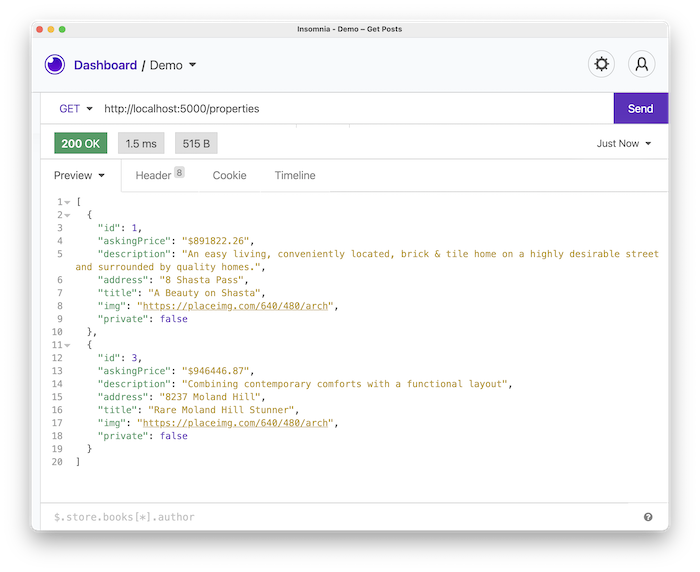
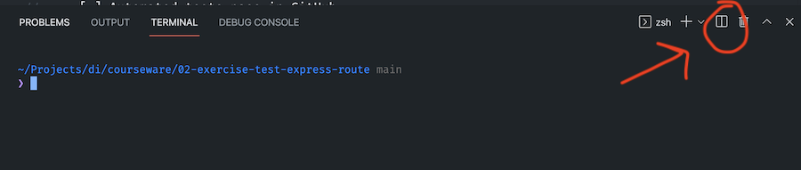

# 02 Exercise - Test an Express Route

## Brief

An endpoint exists that retrieves all the property listings for a Real Estate Agency called House Tricks. Your Tech Lead has provided you with the Express route that displays a subset of the properties. You need to add an automated test that checks the `GET` method for the `/properties` route returns the correct response.

The endpoint you build will meet the following specifications:

### Request

- Endpoint: `/properties`
- Method: `GET`

### Response 

- Status code: `200`
- JSON body: See screenshot below

## Getting Started

1. Open your Terminal in VS Code, and install the required dependencies: `npm install`.
2. Ensure the existing tests pass by typing: `npm test`.
3. Start the API server: `npm start`.

## Instructions Part A - Install SuperTest

Jest has already been installed in this project. You only need to add `supertest`.

1. In your Terminal, create a new terminal window by clicking the "Split Terminal" icon. This will allow you to type extra commands while your server is still running.

   

2. Type: `npm install supertest --save-dev` in your new Terminal window. This will save `supertest` as a development dependency. 
3. Add and commit the changes made to `package.json` and `package-lock.json`.

## Instructions Part B - Test the `/properties` route

1. Create a new file in the `src` folder: `app.test.js`.
2. In this file, write a test using SuperTest that checks the `/properties` route works as expected

--- 

# Submit your Exercise

- [ ] Automated tests pass in GitHub
- [ ] Turned in exercise in Google Classroom
