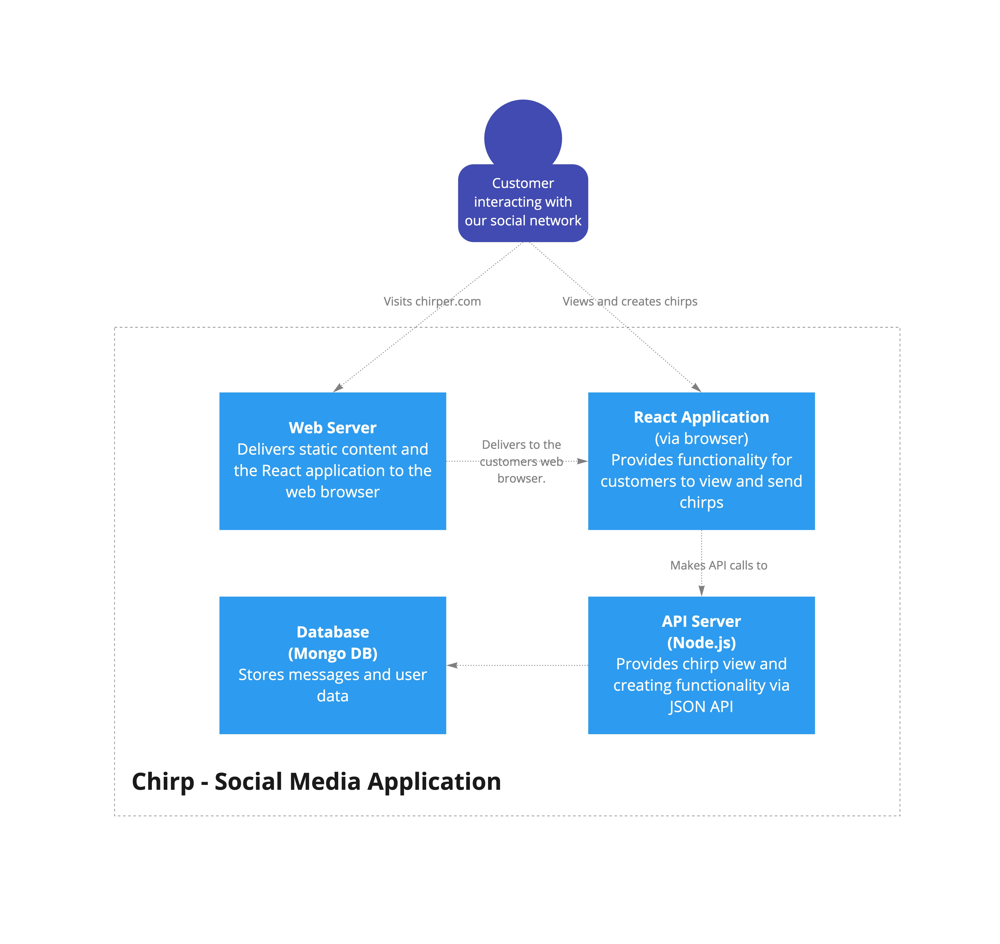
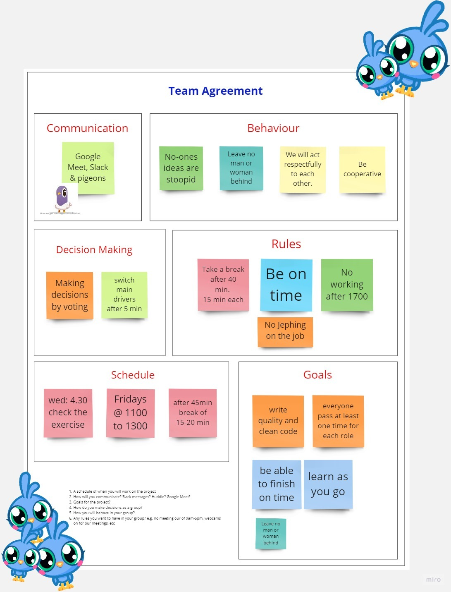

# 02 Shared group exercise

As an accountability group, you will be working in this repository to build an API and front-end for a social media app "Chirpie". You can use it as a reference throughout the term.

## Getting started

1. Open this project in your VS Code by cloning the repository

### Server

This is where your server API code lives

2. Open your terminal, go to the `server` folder, `cd server` and install your Node dependencies: `npm install`
3. Start the server: `npm start`

### Client

This is where your front-end code lives

4. Open your terminal, go to the `client` folder, `cd client` and install your Node dependencies: `npm install`
5. Start the server: `npm start`

# Architecture

# Team Agreement

# Rest API

### Request details

| Endpoint: | /api/chirps/:id |
| --------- | --------------- |
| Method:   | GET             |

### Response details

| status code: | 200 |
| ------------ | --- |
| Example body | {   |

“chirpId”: 1,
“name” : “RapidAPI”,
”userName” : “@Rapid_API”,
“date” : “2023-01-27T03:23:43.233Z“,
“message”: “Let’s break down the process of building a REST API from scratch using Node.js and Express. Thread (emoji) (emoji)”,
“image”: “location.example”,
“replies”: 24,
“retweets”: 420,
“likes”: 1300
}
|

## Retrieve all chirps

### Request details

- Endpoint: /api/chirps
- Method:GET

### Response details

- Status code: 200

- Example body

[
{
“chirpId”: 1,
“name” : “RapidAPI”,
”userName” : “@Rapid_API”,
“date” : “2023-01-27T03:23:43.233Z“,
“message”: “Let’s break down the process of building a REST API from scratch using Node.js and Express. Thread (emoji) (emoji)”,
“image”: “location.example”,
“replies”: 24,
“retweets”: 420,
“likes”: 1300
},

---

{
“chirpId”: 2,
“name” : “Joe Chang”,
”userName” : “@joe_theCoder”,
“date” : “2023-02-07T03:23:43.233Z”,
“message”: “Day51 #100DaysOfCode Finished the first node project, and decide to make it bigger and more presentable after gaining more knowledge in React!!”,
“image”: “location.example”,
“replies”: 3,
“retweets”: 6,
“likes”: 7
},

---

{
“chirpId”: 3,
“name” : “Joe Chang”,
”userName” : “@joe_theCoder”,
“date” : “2023-04-28T12:23:43.143Z”,
“message”: “Day 54 of #100DaysOfCode practice with a simple page with React after a long & busy day.
Also, thanks @CodeOnLoop, for being such a wise and supportive friend on this journey!! The dev community are the best!!”,
“image”: “location.example”,
“replies”: 3,
“retweets”: 6,
“likes”: 15
},

---

{
“chirpId”: 4,
“name” : “Manpreet Singh”,
”userName” : “@ManpreetCoderI”,
“date” : 2023-02-05T03:23:43.233Z,
“message”: “How to specify attributes in JSX?
Using curly braces to embed a javascript expression is an attribute
Don’t put quotes around curly braces when embedding a javascript expression in an attribute
Define attributes with camelcase naming convention #javascript #React
(image attached)”,
“image”: “location.example”,
“replies”: 0,
“retweets”: 3,
“likes”: 3
}
]

## Create a single chirp

### Request details

- Endpoint: /api/chirps
- Method:POST

---

Example body

{
“chirpId”: 0,
“name” : “Jeph”,
”userName” : “@Jeph”
“date” : “2023-01-27T03:23:43.233Z“,
“message”: “What's happening?, how come I’m awake”,
“image”: “location.example”,
“replies”: 0,  
“retweets”: 0,
“replies”: 0,  
}

### Response details

- Status code: 200

---

### Example body

[
{
“chirpId”: 1,
“name” : “RapidAPI”,
”userName” : “@Rapid_API”,
“date” : “2023-01-27T03:23:43.233Z“,
“message”: “Let’s break down the process of building a REST API from scratch using Node.js and Express. Thread (emoji) (emoji)”,
“image”: “location.example”,
“replies”: 24,
“retweets”: 420,
“likes”: 1300
},

---

{
“chirpId”: 2,
“name” : “Joe Chang”,
”userName” : “@joe_theCoder”,
“date” : “2023-02-07T03:23:43.233Z”,
“message”: “Day51 #100DaysOfCode Finished the first node project, and decide to make it bigger and more presentable after gaining more knowledge in React!!”,
“image”: “location.example”,
“replies”: 3,
“retweets”: 6,
“likes”: 7
},

---

{
“chirpId”: 3,
“name” : “Joe Chang”,
”userName” : “@joe_theCoder”,
“date” : “2023-04-28T12:23:43.143Z”,
“message”: “Day 54 of #100DaysOfCode practice with a simple page with React after a long & busy day.
Also, thanks @CodeOnLoop, for being such a wise and supportive friend on this journey!! The dev community are the best!!”,
“image”: “location.example”,
“replies”: 3,
“retweets”: 6,
“likes”: 15
},

---

{
“chirpId”: 4,
“name” : “Manpreet Singh”,
”userName” : “@ManpreetCoderI”,
“date” : 2023-02-05T03:23:43.233Z,
“message”: “How to specify attributes in JSX?
Using curly braces to embed a javascript expression is an attribute
Don’t put quotes around curly braces when embedding a javascript expression in an attribute
Define attributes with camelcase naming convention #javascript #React
(image attached)”,
“image”: “location.example”,
“replies”: 0,
“retweets”: 3,
“likes”: 3
},

---

{
“chirpId”: 5,
“name” : “Jeph”,
”userName” : “@Jeph”
“date” : “2023-01-27T03:23:43.233Z“,
“message”: “What's happening?, how come I’m awake”,
“image”: “location.example”,
“replies”: 0,  
“retweets”: 0,
“replies”: 0,  
}
]

## test

test test
