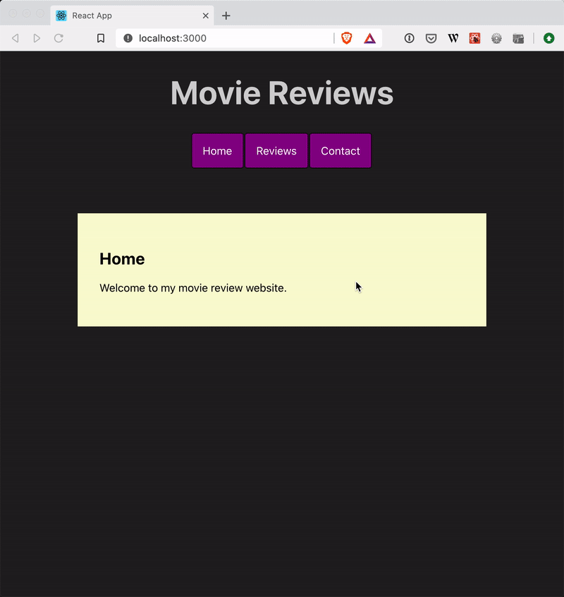
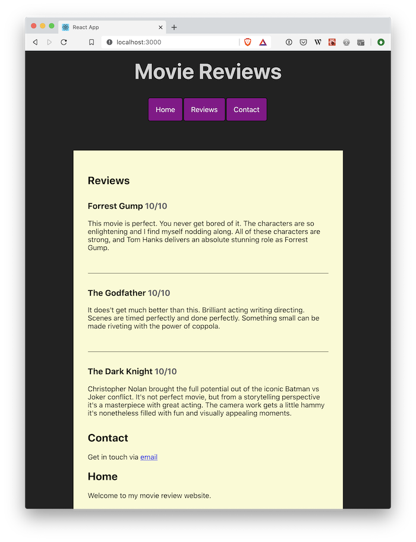

[](https://classroom.github.com/online_ide?assignment_repo_id=11191857&assignment_repo_type=AssignmentRepo)
# Exercise - React Router

## Brief



For this exercise, we will take an existing React application, extend it to have multiple pages, and add content.

## Rationale

Websites often need multiple pages, each with a unique URL. Using React Router allows our website visitors to navigate between pages without causing the page to reload, considerably speeding up your site. Faster websites keep users happier, leading to better engagement.

See how React Router makes creating multiple pages intuitively by using React Components. React Components used in this way results in the website being far easier to maintain.

Using React components, you can quickly create page templates to reduce the amount of repetition in your code.

## Instructions Part A - Start the development server

<details>
  <summary>Start the development server</summary>
<br>

To start the development server, navigate to the root folder of this challenge via your terminal. You can do this by opening the terminal in VS Code. Once you have the terminal ready, type the following commands:

```shell
# install the server dependencies
npm install

# start the webserver
npm start
```

Once the server starts running, it should automatically open your browser to the following site: [http://localhost:3000](http://localhost:3000)

All things going well, you should see a website that looks similar to the following.



</details>

## Instructions Part B - Install React Router

<details>
  <summary>Install React Router</summary>
<br>

The following instructions are from the [React Router Quick Start](https://reactrouter.com/web/guides/quick-start) documentation.

1. Install the React Router package from npm

   ```shell
   npm install react-router-dom
   ```

2. Import the React Router package to `src/App.js`. At the top of the file, copy and paste the following code:

   ```js
   import { Routes, Route, Link } from "react-router-dom";
   ```

3. Import the React Router package to `src/index.js`. At the tope of the file, copy and paste the following code;

```js
import { BrowserRouter } from "react-router-dom";
```

This imports all the things we need from React Router to use in our React application.

</details>

## Instructions Part C - Display pages based on URL

<details>
  <summary>Display pages based on URL</summary>
<br>

For this part, you will use React Router to display particular components when URLs are visited in the web browser.

**Important:** React Router has a [basic example](https://reactrouter.com/docs/en/v6/examples/basic) which you should refer to when completing the rest of this exercise. You can use this example and skip the instructions below if you prefer.

You first need to wrap the existing `App` component in the `<BrowserRouter>` component from React Router. This enables React Router to control your app.

1. Open `src/index.js`, and find the `App` component.
2. Update so the `App` component is wrapped with the `<BrowserRouter>` component from React Router. Make sure you have opening `<BrowserRouter>` and closing `</BrowserRouter>` tags within the existing `<React.StrictMode>` component and outside the `<App />` component .
3. Your component should now look something like this:

   ```jsx
   ReactDOM.render(
      <React.StrictMode>
        <BrowserRouter>
        <App />
      </BrowserRouter>
      </React.StrictMode>,
      document.getElementById("root")
    );
   }
   ```

Now you need to make React Router display particular components when a route is visited. Routes are used to display different pages to the users. For example, http://localhost:3000/**reviews** will show movie reviews.

React Router does this with `<Routes>` and `<Route>` components. These components let you switch what to display depending on the route.

There are three components in `App.js`, named `Reviews`, `Contact` and `Home`. Only one component should be displayed at a time, depending on what page route is being visited, as per the brief.

To achieve this, we will use the `<Routes>` and `<Route>` components from React Router.

1. Wrap the existing three components in the `<Routes>` component, so it looks like the following:

   ```jsx
   <Routes>
     <Reviews />
     <Contact />
     <Home />
   </Routes>
   ```

   React Router will now look for `<Route>` components inside the `<Routes>` component, to switch the pages depending on the routes.

2. Add a `<Route>` component from React Route for each of the existing components. Use the `path` attribute to match the route with the path from the browser URL. The `Home` path should be matched to `/`. Add the exisiting components as part of the `element` attribute. You should end up with the following:

   ```jsx
      <Route path="reviews" element={<Reviews />} />
      <Route path="contact" element={<Contact />} />
      <Route path="/" element={<Home />} />
   ```

3. Your page should now be displaying those routes only when the path matches

**Acceptance criteria**

- When you visit http://localhost:3000 in your browser, only the home page is visible
- When you visit http://localhost:3000/reviews in your browser, only the reviews listing is visible
- When you visit http://localhost:3000/contact in your browser, only the contact page is visible

</details>

## Instructions Part D - Link the navigation

<details>
  <summary>Link the navigation</summary>
<br>

The last step to completing the brief is to make the navigation work without the web page reloading. Currently, when you click a link, the page will reload before it displays. Because the React application already has all the information it needs to display new pages, there is no need for it to reload.

React Router has the `<Link>` component that can be used to solve this problem.

1. Find the navigation in `App.js`. We will replace the existing `<a>` tags with `<Link>` components
2. Replace each of the existing `<a>` tags with `<Link>`. Also, instead of using the `href` attribute, use `to`.
3. Your navigation should now look something like this:

   ```jsx
   <ul>
     <li>
       <Link to="/">Home</Link>
     </li>
     <li>
       <Link to="/reviews">Reviews</Link>
     </li>
     <li>
       <Link to="/contact">Contact</Link>
     </li>
   </ul>
   ```

4. Now when you click the links on your webpage, there are no page reloads

**Acceptance criteria**

- When you click the `Home` link, the browser is redirected to http://localhost:3000, without a page reload
- When you click the `Reviews` link, the browser is redirected to http://localhost:3000/reviews, without a page reload
- When you click the `Contact` link, the browser is redirected to http://localhost:3000/contact, without a page reload

</details>

---

# Submit your Exercise

- [ ] Commits are pushed to GitHub
- [ ] Automated tests pass in GitHub
- [ ] Exercise is submitted in Google Classroom
